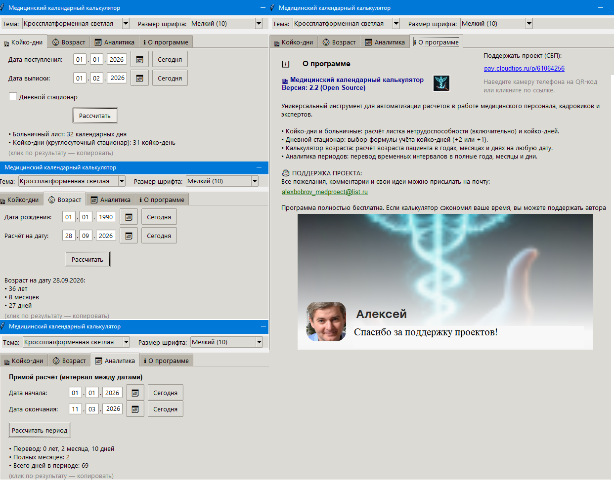

# 🏥 Медицинский календарный калькулятор

[]()
[]()
[]()

**Сделано врачом для врачей.**

Универсальный инструмент для расчётов в работе медицинского персонала, кадровиков и экспертов. Создан, чтобы быстро считать медицинские периоды — без рутины, калькулятора в руках и ошибок.

Программа **не сохраняет** никаких данных пациентов. Ни ФИО, ни диагнозы, ни номера историй болезни. Только даты, которые вы вводите вручную, и результаты расчётов — они нигде не логируются и не отправляются в интернет.

---

## 📥 Скачать

**[⬇ Скачать Medical_Calc_ver_2.3.exe (GitHub Releases)](https://github.com/lemparius1582-lgtm/medical-calc/releases/latest/download/Medical_Calc_ver_2.3.exe)** — для Windows, без установки.

Зеркала:
- [Яндекс.Диск (файл)](https://disk.yandex.ru/d/MfIWdGoYsam6qA) — если GitHub недоступен.
- [Яндекс.Диск (папка со всеми файлами)](https://disk.yandex.ru/d/O-fXEJZTPFi2ew).

*Файл скомпилирован из исходного кода автором. Исходный код открыт в этом репозитории — вы можете проверить его самостоятельно.*

---

## 👨‍⚕️ Для врачей

### Что это

Медицинский калькулятор для расчёта:

- **больничных листов и койко-дней** — с учётом круглосуточного и дневного стационара;
- **возраста пациента на любую дату** — не только «на сегодня»;
- **интервалов между двумя датами** — в годах, месяцах, днях и полных месяцах.

Работает **офлайн**, не требует установки, не требует Python. Просто скачали `.exe` и запустили.

### Кому будет полезно

- Врачам-психиатрам (расчёт длительных госпитализаций).
- Терапевтам и врачам общей практики (больничные листы).
- Кадровикам и экспертам (расчёт периодов).
- Всем, кому нужно считать интервалы между датами.

### Скриншот



### Как пользоваться

1. **Скачайте** `Medical_Calc_ver_2.3.exe` по ссылке выше.
2. **Запустите** двойным кликом (см. раздел «Если Windows блокирует запуск»).
3. **Выберите вкладку** сверху: «Койко-дни», «Возраст» или «Аналитика».
4. **Введите даты** — тремя полями (день, месяц, год) или через календарь (📅).
5. **Нажмите «Рассчитать»**.
6. **Клик по результату** — копирует его в буфер обмена для вставки в документ.
7. **Настройки** сохраняются автоматически между запусками.

### Что считает

| Вкладка | Что делает |
|---|---|
| **🏥 Койко-дни** | Больничный лист (включительно) + койко-дни. Отдельно для круглосуточного и дневного стационара. Для дневного — выбор формулы (+2 или +1) под правила вашего учреждения. |
| **👶 Возраст** | Точный возраст пациента в годах, месяцах и днях на любую дату. |
| **📅 Аналитика** | Полные года/месяцы/дни между двумя датами, полных месяцев, всего дней. |
| **ℹ О программе** | Описание, ссылки, поддержка проекта, версия. |

### Что программа **не** делает

Честно и сразу:

- **Не ставит диагнозы** и не подсказывает лечение.
- **Не интегрируется** с МИС, ЕГИСЗ и другими медицинскими системами.
- **Не хранит** данные пациентов (кроме дат для удобства — см. ниже).
- **Не является медицинским изделием** и не заменяет клиническое суждение.

### Если Windows блокирует запуск

При первом запуске `.exe` Windows может показать окно:

> *«Windows защитила ваш компьютер. Запуск этого приложения может быть опасным».*

**Это нормально** для любого `.exe`, который не подписан коммерческим сертификатом (сертификат стоит больше 500 USD в год — нецелесообразно для некоммерческого проекта).

**Что делать:**

1. Нажмите **«Подробнее»** в окне предупреждения.
2. Внизу появится кнопка **«Выполнить в любом случае»** — нажмите её.
3. Программа запустится.

**Альтернатива:** правый клик по `.exe` → «Свойства» → галочка **«Разблокировать»** внизу → «ОК». После этого Windows перестанет блокировать.

### Про данные пациентов

Программа **не сохраняет** никаких данных пациентов. Ни ФИО, ни диагнозы, ни номера историй болезни. Настройки (тема, размер шрифта, последние введённые даты) хранятся локально в файле:

```
C:\Users\<Ваше_имя>\.medical_calc_settings.json
```

Если вы **не хотите**, чтобы программа запоминала даже эти даты — удалите указанный файл после работы. Программа создаст новый при следующем запуске.

### Если что-то не работает

- **Не сохраняются настройки** — напишите на почту с описанием проблемы: **alexbobrov_medproect@list.ru**
- **Не запускается `.exe`** — см. раздел «Если Windows блокирует запуск» выше.
- **Что-то другое** — напишите на ту же почту.

---

## 💻 Для разработчиков

### Стек

- **Python 3.10+**
- **tkinter** (входит в стандартную поставку Python)
- **tkcalendar** — виджет календаря
- **python-dateutil** — расчёты с датами через `relativedelta`

### Установка зависимостей

```bash
pip install tkcalendar python-dateutil
```

### Запуск из исходников

```bash
python medical_calc.py
```

### Сборка `.exe`

```bash
pip install pyinstaller
pyinstaller --noconsole --onefile --name Medical_Calc_ver_2.3 medical_calc.py
```

Готовый файл появится в папке `dist/`.

### Структура кода

Сейчас — один файл `medical_calc.py`, но внутри разделён на логические части:

- **`App`** — каркас приложения: окно, вкладки, темы, размер шрифта, сохранение настроек. Ничего не знает про смысл расчётов.
- **`TabBase`** — базовый класс для вкладок. Каждая вкладка сама описывает, что сохранять (`get_settings`) и как восстанавливать (`apply_settings`), и может реагировать на смену темы (`apply_theme`).
- **`DateInput`** — виджет ввода даты: три поля ДД / ММ / ГГГГ с автопереходом, вставкой и валидацией.
- **Вкладки**: `MedicalTab`, `AgeTab`, `PeriodTab`, `AboutTab` — каждая отвечает только за свою логику.

### Как добавить свою вкладку

1. Создайте класс — наследник `TabBase`:

```python
class MyCalcTab(TabBase):
    title = "🧮 Мой расчёт"
    settings_key = "my_calc"

    def __init__(self, parent):
        super().__init__(parent)
        # ... ваши виджеты ...

    def get_settings(self):
        return {"param": ...}

    def apply_settings(self, data):
        # ... восстановление ...
        pass
```

2. Зарегистрируйте её в `App._register_default_tabs` — добавьте класс в кортеж:

```python
for cls in (MedicalTab, AgeTab, PeriodTab, AboutTab, MyCalcTab):
    ...
```

3. Готово. `App` сам вызовет `get_settings`/`apply_settings`, добавит вкладку в блокнот и применит к ней текущую тему.

### Как добавить тему

В словаре `NATIVE_THEMES` — список системных тем ttk. Добавьте новую строку:

```python
NATIVE_THEMES = {
    "Windows (системная)": "vista",
    # ...
    "Моя тема": "имя_темы_в_ttk",
}
```

Темы, недоступные на текущей ОС, **автоматически скрываются** из выпадающего списка — программа не упадёт.

### Лицензия

MIT — используйте, форкайте, улучшайте. Указывайте авторство в исходниках.

---

## ⚖️ Нормативная база

Расчёт койко-дней в круглосуточном и дневном стационаре соответствует общим правилам учёта, действующим в РФ. Для дневного стационара в программе предусмотрен **выбор формулы**:

- **`+2` (стандарт)** — день поступления и день выписки считаются каждый за 1 день.
- **`+1`** — если в вашем учреждении действуют внутренние правила учёта.

**Перед подачей официальных документов сверяйтесь с локальными нормативными актами вашего учреждения.** Автор не гарантирует соответствие расчётов правилам конкретного медицинского учреждения.

---

## 📌 Планы

- **v3.0** — версия для Linux (запрос от коллег).
- **v3.x** — модуль обратного расчёта (перевод дней в годы/месяцы/дни).
- **v3.x** — указание на високосные года (прошлые и будущие) — для точных расчётов.
- **v3.x** — расширение списка специальностей (по запросам).

Идеи и запросы — приветствуются. Пишите на почту или создавайте обсуждение на GitHub.

---

## ☕ Поддержать проект

Если этот калькулятор сэкономил вам время и помог в работе, вы можете поддержать автора:

- 💳 **[Перевести на кофе (СБП / карта)](https://pay.cloudtips.ru/p/61064256)**
- 📱 **QR-код для СБП** — откройте вкладку «О программе» в самом калькуляторе
- ⭐ **Поставить Star** этому репозиторию — автору будет очень приятно!

---

## 💬 Обсуждение и обратная связь

- **Обсуждения:** [GitHub Discussions](https://github.com/lemparius1582-lgtm/medical-calc/discussions)
- **Email:** alexbobrov_medproect@list.ru

---

## 🙏 Благодарности

Отдельное спасибо коллегам, которые помогли с тестированием и идеями:

<!-- Заполните по мере появления имён, если они не против публикации -->

---

## 📌 История версий

Радикальные изменения — здесь. Мелкие правки — в истории коммитов.

### v2.3
- Системные темы ttk (вместо кастомных).
- Пресеты размера шрифта.
- Скролл во вкладке «О программе».
- Три поля ввода даты (`DateInput`) вместо маски.
- Опция выбора формулы койко-дней для дневного стационара.
- Разделение на `TabBase` + вкладки.
- Удалён обратный расчёт дней.
- Добавлены QR-код и ссылка на донат.
- Добавлен блок «Обновления и связь».

### v2.2
- Первый публичный релиз.
- Вкладки «Койко-дни», «Возраст», «Аналитика», «О программе».
- Ввод даты с маской `ДД.ММ.ГГГГ`.
- Сохранение настроек между запусками.

---

## ⚠️ Отказ от ответственности

Программное обеспечение предоставляется на условиях **«КАК ЕСТЬ» (AS IS)**, без каких-либо явных или подразумеваемых гарантий. Автор не несёт ответственности за любые ошибки в расчётах, финансовые потери, штрафы или иные последствия, возникшие в результате использования ПО. Программа **не является медицинским изделием** и не заменяет клиническое суждение врача.

Перед подачей официальных документов всегда проверяйте данные вручную.

---

*Сделано врачом для врачей. Если у вас есть идеи по улучшению — напишите на почту или создайте обсуждение на GitHub.*
